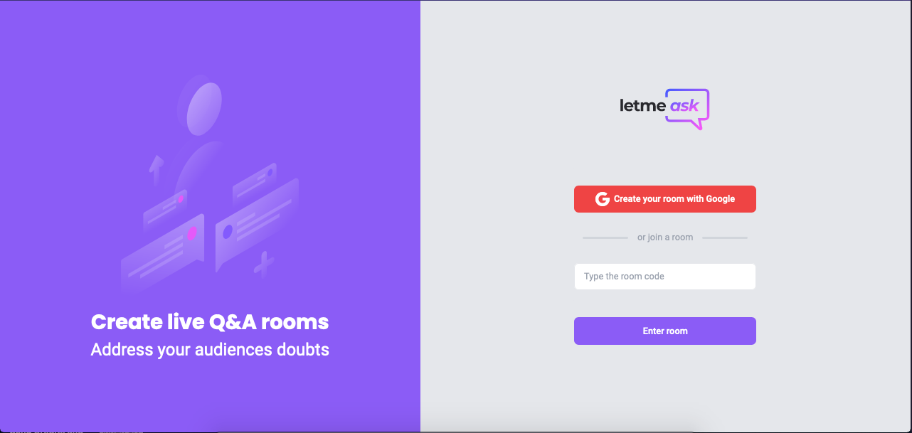
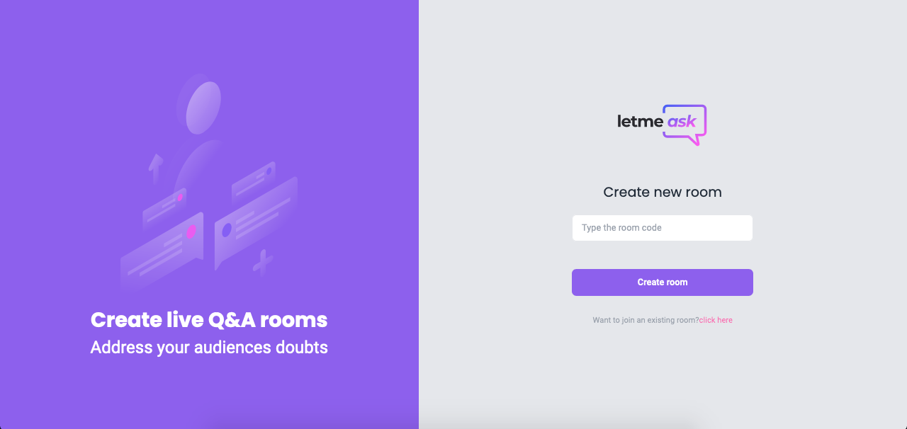

# Move It:

## Content

1. [Motivation](#Motivation) 
2. [Requirements](#Requirements)
3. [Pages](#Pages)
    - [Home](#Home)
    - [NewRoom](#NewRoom)

## Motivation

This repository holds a project called [`LetMeAsk`](https://letmeask-it.vercel.app/). In this project, I created a platform in which users can post their questions, for other users to answer or interact with user Q&A's.

You can run it by cloning the repository. Running `cd letmeask`,`yarn install` then executing the command `npm run start`.

## Requirements

Typescript, Firebase, Tailwind Css, and more.

## Pages
### *Home*

##### /

###### Log In or Join Room

Log in with google to create a room. Or join an existing Q&A using the room ID.

### *NewRoom*

##### /rooms/new

###### Create Room

Create a room for your Q&A.

